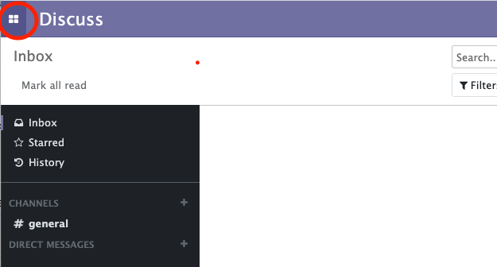
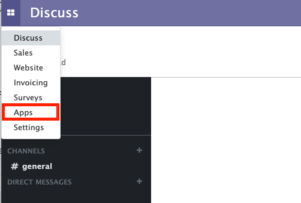
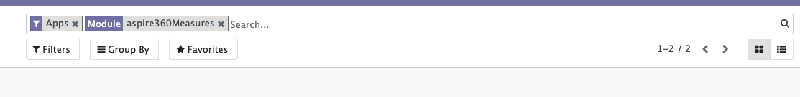
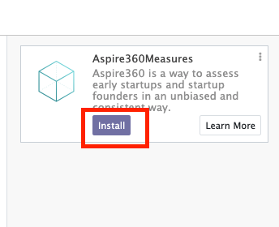
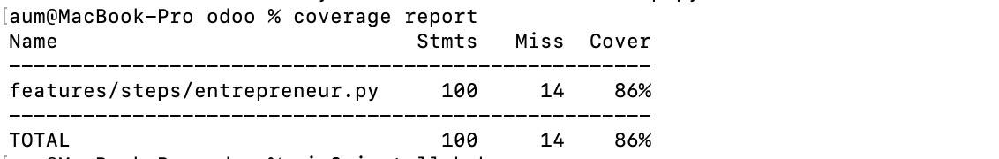
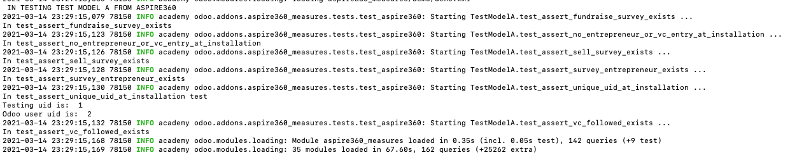

# COMS4156 Advanced Software Engineering - Group Project

## Group Members

	Member 1 Name: Phan Anh Nguyen
	Member 1 UNI: pn2363

	Member 2 Name: Wei-Lun Tsai
	Member 2 UNI: wt2317

	Member 3 Name: Aum Divyang Upadhyay
	Member 3 UNI: adu2104

	Member 4 Name: Hariharan Jayakumar
	Member 4 UNI: hj2559

## Problem Statement

- The key pain points for founders are:
	1. Finding the right investors in their companies that can help set them up for success
	2. Once talks have been initiated with VCs, many times the founder will not get responses, creating the need for a more systematic approach to getting funding. 
	3. Finding the right mentors who can guide the company

- For VCs the pain points are:
	1. Finding businesses and Founders they would like to invest in
	2. Keeping track of companies and founders they are interested in

- Overall, the lack of a direct approach to connect VCs with companies they are likely to invest in leads to a significant amount of time and resources being wasted.

## Product Introduction and Features

- We hope to build a SaaS product is a platform that can match VCs and startups based on a set of assessments to measure startups based on their readiness to fundraise and sell. Startups respond to each survey using scale-values that best represent their situation. VCs can then search for these companies and reach out to them to initiate first communication.

- Our product will be built on the Odoo platform, a CRM/ERP software platform that provides multiple business-suite modules and applications. Our goal is to build an installable module that can be installed by existing users and integrated with pre-installed platform modules.

- For iteration 1: We mainly focused on setting up an installable app that can be integrated and accepted by the Odoo platform. Basic functionality that we have set up is: Initial setup logic and validation when users first log into the homepage and select whether they are a VC investor or Entrepreneur CEO. We also have implemented basic assessment-taking capabilities where entrepreneurs can take either the *Readiness to Fundraise Assessment* or the *Readiness to Sell Assessment*. 

- For iteration 2: We focussed on building features for investors during this iteration. We were able to implement search capabilities that allow investors to search for entrepreneurs and their companies based on sets of filters and company name search. We also implemented survey results retrieval capabilities so that companies that show up in a search will also present their latest survey metrics. Additionally, we experimented with a simple mailing feature that we will expand on for the final iteration in addition to upgrading the entrepreneur dashboards.

- For final iteration: For our final iteration, we implemented additional features for entrepreneurs such as the ability to add objectives. For venture capitalists, we implemented a quick-following feature that would allow venture capitalists to effectively 'bookmark' and quickly access the most recent assessment metrics for their followed entrepreneurs. Lastly, we implemented integration with Odoo Discuss module where we enable venture capitalists to fill out a contact form to reach out to entrepreneurs. This will create a private channel where further conversations regarding coaching and funding can occur. 

## Download and Installation Instructions for TAs

- As our product is a module built within Odoo, module setup would require installation of the original Odoo platform as well as setting up a PostgreSQL database.
- As discussed with Professor Yang, we hope to set up a Zoom session with the TAs where we can walk through installation and demo-ing with the TAs as needed. Please reach out to any of us and we would be very glad to set up time with you whenever you are available. 
- Currently we are exploring 2 possible ways to set up Odoo: 

    ### 1. Local Source install: 
    - Please go to the following link: https://www.odoo.com/documentation/14.0/setup/install.html#source-install
    - Follow the "Source Install" section to install the official release of Odoo locally
    - Clone our github repo (provided below) into any local folder.
    - Create a directory called "my-modules" in the Odoo main directory such that the following path exists: "Odoo/my-modules"
    - Copy our module names "aspire360_measures" into the "my-modules" directory such that the following path exists: "Odoo/my-modules/aspire360_measures"
    - Lastly, to set up BDD testing, copy the "/features" directory that currently exists in "Odoo/my-modules/aspire360_measures/features" to the main Odoo directory such that the following path exists: "Odoo/features".
    - Odoo instance can be started with the following command: 
    ```
    python3 odoo-bin --addons-path addons,my-modules -d mydb
    ```  
    - Go to "localhost:8069/web/login" to access the Odoo platform 
    - We will walk TAs through this entire process over Zoom
    ### 2. Access to already set up Amazon EC2 instance:
    - We are currently ironing out some issues setting up *Behave* testing on EC2 but ideally we can provide TAs with AWS keys to access the EC2 instance, where we have already set up the correct file structure for hosting. TAs can than easily inspect the files within the EC2 instance itself.

- Once Odoo has been installed, TAs may visit localhost:8069/web/login and login with the provided credentials to access the Odoo account. 
- Navigate to the top left corner and click on the symbol shown below:

    

- Click on the Apps option:

    

- Search for "Aspire360Measures" in the searchbox: 

    

- Install our module: 

    

- Navigate to: localhost:8069/aspire360measures/ to land on the homepage of our application.

## Testing

1. **BDD**:
+ We used *Behave*, a python-based testing package, to incorporate Cucumber tests and implement BDD.
+ Behave Installation:

    + The test cases and code are in the directory /folders. To run the tests, please copy /features to the root of the project so it is in the same folder as SECURITY.md and COPYRIGHT. 
    + To install the required libraries do:
    ```
    pip3 install behave
    pip3 install selenium
    pip3 install coverage
    ```
    + MacOS:
    ```
    brew install chromedriver
    ```
    + Windows:
    ```
    choco install chromedriver
    ```
    + **Note for TAs** In line 12 of entrepreneur.py in features/steps confirm the string is the path to the chromedriver on your machine and then save the file.

+ Behave Execution:
    + Then, typing "behave" into the command line will run the tests. Google chrome drivers will be used, so expect a chrome window to pop up. To see the code coverage, type "coverage report".

2. **TDD**:

+ Odoo requires unit tests to be written under a defined sub-package called "tests". Our unit tests are located in the following directory: "my-modules/aspire360_measures/tests"
+ Unit tests for the module are ran automatically by the platform once a module is upgraded or installed. 
+ To enable automatic testing, the odoo-platform must be started with the following command: 
    ```
    python3 odoo-bin --addons-path addons,my-modules -d mydb -u aspire360_measures --test-enable
    ```  
+ **Note for TAs**: Odoo automatically runs tests for all installed modules at upgrade, which may take a while. Tests for our module is denoted by the printed flag "IN TESTING MODEL TEST MODEL A FROM ASPIRE360". We have added additional flags for each test being ran under the flag "In test: <test_name>". In our experience, the aspire360 module is usually updated last so tests will be at the end of server log. We have attached images of the testing logs.


## Testing results
+ Cucumber/Behave

    

+ Unit tests

    


## Project code:
+ A link to our github repo can be found here: https://github.com/phananh1096/aspire360_measures/

## Hosting:
+ Odoo has known incompatibilities and difficulties with heroku hosting: https://stackoverflow.com/questions/25424018/can-i-deploy-openerp-on-heroku
+ Any custom workaround has not been maintained in the last 2-3 years. Current Aspire360 production version of Odoo is hosted on Amazon EC2, therefore, we followed the same structure for our hosting. 
+ Our project is hosted on AWS EC2, which can be found here: http://ec2-54-237-23-92.compute-1.amazonaws.com:8069/web/login
